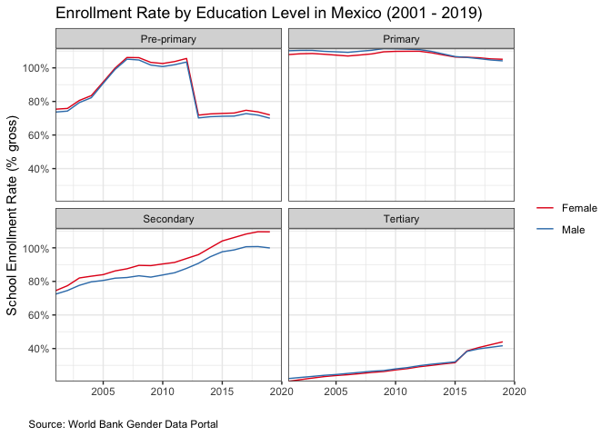
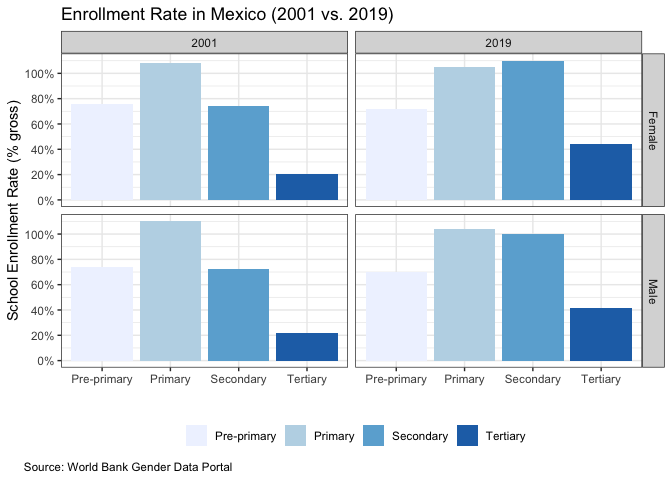

Sample Code for World Bank Gender Brief
================

``` r
#------------------------------------------------------------------------------#
#                 Sample Code for World Bank Gender Brief                      #
#                    R reproducibility master script                           #
#               Data Source: World Bank Gender Data Portal                     #
#                       Country: Mexico                                        #
#                     Indicator: Education                                     #
#------------------------------------------------------------------------------#

# PART 1: User input ----------------------------------------------------------

  # root folder ---------------------------------------------------------------
  github  <- "/Users/Rigzom/Documents/GitHub/WB-Gender-Brief-Sample" # Replace with the root folder the repository was cloned

# PART 2: Load packages   -----------------------------------------------------
    
  packages  <- c( "tidyverse", "ggthemes", "RColorBrewer" )

  pacman::p_load(packages, 
                 character.only = TRUE) 

# PART 3: Set folder folder paths ---------------------------------------------
 
  # Project subfolders
  data    <- file.path(github, "Data")
  output  <- file.path(github, "Output")
  code    <- file.path(github, "Code")

# PART 4: Load data  ----------------------------------------------------------
  
  raw_data <- read_csv(file.path(data, "cbbb0bbd-0117-432f-838e-b725966c77ae_Data.csv"), 
                       col_select = -c("Country Name", "Country Code")) %>%   # Since we know the country is Mexico, these columns are not needed
              rename(series_name = "Series Name", # Rename these two variable so there are no character breaks
                     series_code = "Series Code") %>%
              filter(!is.na(series_code)) # Remove excess rows
  

# PART 5: Prepare data  -------------------------------------------------------
 
  clean_data <- raw_data %>% 
                mutate(gender = case_when(str_detect(series_name, "female") ~"Female", # Create a var for gender for easier filtering later
                                            str_detect(series_name, "Female") ~"Female",
                                            str_detect(series_name, "male") ~"Male",
                                            str_detect(series_name, "Male") ~"Male")) %>%
                separate(series_name, 
                         into = c("var1", "var2", "var3", "var4"), # Split series_name into 4 vars to make it easier for filtering later 
                         sep = ",", remove = F)
 
# PART 6: Create function to reshape data from wide to long -------------------
  # This function will create a year column and value column 
  reshape_long <- function(data_wide) {
                    data_long <- data_wide %>% 
                                  pivot_longer(cols = starts_with("20"),
                                               names_to = "year",
                                               values_to = "value") %>% 
                                  mutate(year = as.numeric(str_sub(year, 1,4))) # Covert year from "20xx [YR20xx]" to "20xx"
                    data_long$year <- as.numeric(data_long$year) # Make numeric 
                    data_long$value <- as.numeric(data_long$value) # Make numeric 
                    return(data_long)
                  }
  
# PART 7: Sample graphs on School Enrollment ----------------------------------

  # Time Series 
    # Filter and reshape data for creating graph  
      plot_df <- clean_data %>% filter(var1 == "School enrollment" & str_detect(var3, "% gross")) # filter data using relevant variables 
      plot_df <- reshape_long(plot_df) # reshape to long 
    
    # Plot and save graph 
      plot1 <- plot_df %>% 
                mutate(var2 = factor(var2, 
                                     labels = c("Pre-primary", "Primary", "Secondary", "Tertiary"))) %>% # Relabel with first letter capitalized
                # divide value by 100 i.e. into decimal, so you can later create y axis tick marks to show % (line 90)
                ggplot(aes(x = year, y = value/100, group = gender, colour = gender)) + 
                geom_line() +
                scale_color_brewer(palette = "Set1") +
                facet_wrap(. ~ var2) +
                theme_bw() +
                coord_cartesian(expand = F) +
                scale_y_continuous(breaks = seq(0, 1.2, 0.2),
                                   labels = scales::percent) + # tick marks in percent
                labs(title = "Enrollment Rate by Education Level in Mexico (2001 - 2019)",
                   x = "",
                   y = "School Enrollment Rate (% gross)",
                   caption = "Source: World Bank Gender Data Portal") +
                theme(legend.title = element_blank(),
                      plot.caption = element_text(hjust =-0.1)) 
      
      png(file.path(output, "school_enrollment_gross_timeseries.png")) # save in Output folder 
        plot1
      dev.off()
```

    ## quartz_off_screen 
    ##                 2

``` r
      plot1 # View school enrollment time series 
```

<!-- -->

``` r
  # Bar chart comparing 2001 vs 2019
    # Plot and save graph 
      plot2 <- plot_df %>% 
                filter(year == 2001 | year == 2019) %>% 
                mutate(var2 = factor(var2, 
                                     labels = c("Pre-primary", "Primary", "Secondary", "Tertiary"))) %>% # Relabel with first letter capitalized
                # divide value by 100 i.e. into decimal, so you can later create y axis tick marks to show % 
                ggplot(aes(x = var2, y = value/100, fill = var2)) + 
                geom_col() +
                scale_fill_brewer(palette = "Blues") +
                facet_grid(gender ~ year) +
                theme_bw() +
                scale_y_continuous(breaks = seq(0, 1.2, 0.2),
                                   labels = scales::percent) + # tick marks in percent
                labs(title = "Enrollment Rate in Mexico (2001 vs. 2019)",
                   x = "",
                   y = "School Enrollment Rate (% gross)",
                   caption = "Source: World Bank Gender Data Portal") +
                theme(legend.title = element_blank(),
                      plot.caption = element_text(hjust =-0.1)) +
                theme(legend.position = "bottom")
      
      png(file.path(output, "school_enrollment_gross_barchart.png")) # save in Output folder 
        plot2  
      dev.off()
```

    ## quartz_off_screen 
    ##                 2

``` r
      plot2 # View school enrollment 2001 vs. 2019
```

<!-- -->

``` r
# END SAMPLE CODE -------------------------------------------------------------
```
